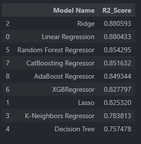
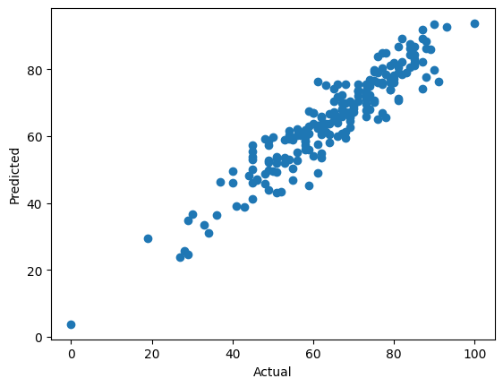
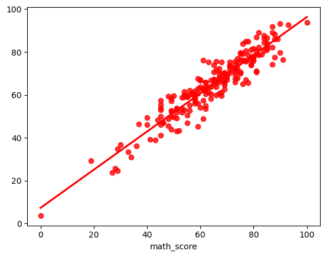

Photo by <a href="https://unsplash.com/@romankraft?utm_content=creditCopyText&utm_medium=referral&utm_source=unsplash">Roman Kraft</a> on <a href="https://unsplash.com/photos/a-yellow-background-with-the-word-study-spelled-out-F0EipXnkeE4?utm_content=creditCopyText&utm_medium=referral&utm_source=unsplash">Unsplash</a>


[](https://github.com/ellerbrock/open-source-badges/)

Badge [source](https://shields.io/)

# Student Performance Predictor

In this project we are developing Flask Application which can predict the Maths Score of the students. This is an end to end Machine learning portfolio project which involves the Exploratory Analysis, Model Development and Model training. Machine Learning Project is implemented with MLOps and CI/CD pipelines. MLOps consists of Data Ingestion, Data Transformation, Model Trainer, Model Evaluation and Model Deployment. 

## Authors

- [Samith Chimminiyan](https://www.github.com/samithcsachi)

## Table of Contents

- [Authors](#Authors)
- [Table of Contents](#table-of-contents)
- [Problem Statement](#problem-statement)
- [Tech Stack](#tech-stack)
- [Data source](#Data-source)
- [Quick glance at the results](#Quick-glance-at-the-results)
- [Lessons learned and recommendation](#lessons-learned-and-recommendation)
- [Limitation and what can be improved](#limitation-and-what-can-be-improved)
- [Run Locally](#run-locally)
- [Explore the notebook](#explore-the-notebook)
- [Contribution](#contribution)
- [License](#license)

## Problem Statement 

This app predicts the math score of the students by providing the other features. App will receive the details and use the model to predict the result. 


## Tech Stack

- pandas
- numpy
- seaborn
- matplotlib
- scikit-learn
- catboost
- xgboost
- dill
- Flask

## Data source

Kaggle Link : - [https://www.kaggle.com/datasets/spscientist/students-performance-in-exams?datasetId=74977](https://www.kaggle.com/datasets/spscientist/students-performance-in-exams?datasetId=74977)

- Data send contains the Gender, Ethnicity, Parental level of education, Lunch and Test preparation course by the students in various subjects.

- The data consists of 8 column and 1000 rows.

## Quick glance at the results

Final Results of the Model



Plots of Actual Score and Predicted Score 







- ***The final model used is: Linear Regression***
- ***Metrics used: R2_Score***
- Why choose precision as metrics:
  Since the objective of this problem is to predict the math score with accuracy have used R² Score. The R² Score, also known as the Coefficient of Determination, is a popular metric for evaluating regression models. It explains how well the predicted values from your model approximate the actual data points.

    R² Score is used when we care about how much variance in the target variable is captured by the model.

    Conclusion: In our case, since we need to predict the score without much varriance  we will use R² Score as our metric.


## Lessons learned and recommendation

During our analysis we have found the below: 
 
- Student's Performance is related with lunch, race, parental level education
- Females lead in pass percentage and also are top-scorers
- Student's Performance is not much related with test preparation course
- Finishing preparation course is benefitial.


## Limitation and what can be improved

- Accuracy of the model is 88.04 for Linear Regression. Since there is not much difference between Ridge and Linear Regression we choose Linear Regression as our model. Accuracy can be improved further by Fine Tunning the model further.
- Application can deployed in AWS or Azure. Have tried implementing in AWS and Azure But not shown in the Project. Even have tried setting in Docker. 
- Current Dataset is not having much features. Project can be improved by using a Dataset with more features. 


## Run Locally
Initialize git

```bash
git init
```

Clone the project

```bash
git clone https://github.com/samithcsachi/Student_Performance_Predictor.git
```

Open Anaconda Prompt and Change the Directory and Open VSCODE by typing code .

```bash
cd E:/Student_Performance_Predictor

```

Open the command prompt in VSCODE


Activate the conda environment

```bash
conda activate venv/
```

List all the packages installed

```bash
conda list
```
Install the packages in Requirements file. 

```bash
pip install -r requirements.txt
```
Run the application 

```
python application.py

```


## Explore the notebook

GitHub :  [https://github.com/samithcsachi/Student_Performance_Predictor](https://github.com/samithcsachi/Student_Performance_Predictor)

## Contribution

Pull requests are welcome! For major changes, please open an issue first to discuss what you would like to change or contribute.

## License

MIT License

Copyright (c) 2025 Samith Chimminiyan

Permission is hereby granted, free of charge, to any person obtaining a copy
of this software and associated documentation files (the "Software"), to deal
in the Software without restriction, including without limitation the rights
to use, copy, modify, merge, publish, distribute, sublicense, and/or sell
copies of the Software, and to permit persons to whom the Software is
furnished to do so, subject to the following conditions:

The above copyright notice and this permission notice shall be included in all
copies or substantial portions of the Software.

THE SOFTWARE IS PROVIDED "AS IS", WITHOUT WARRANTY OF ANY KIND, EXPRESS OR
IMPLIED, INCLUDING BUT NOT LIMITED TO THE WARRANTIES OF MERCHANTABILITY,
FITNESS FOR A PARTICULAR PURPOSE AND NONINFRINGEMENT. IN NO EVENT SHALL THE
AUTHORS OR COPYRIGHT HOLDERS BE LIABLE FOR ANY CLAIM, DAMAGES OR OTHER
LIABILITY, WHETHER IN AN ACTION OF CONTRACT, TORT OR OTHERWISE, ARISING FROM,
OUT OF OR IN CONNECTION WITH THE SOFTWARE OR THE USE OR OTHER DEALINGS IN THE
SOFTWARE.

Learn more about [MIT](https://choosealicense.com/licenses/mit/) license

## Contact
If you have any questions, suggestions, or collaborations in data science, feel free to reach out:
- 📧 Email: [samith.sachi@gmail.com](mailto:samith.sachi@gmail.com)
- 🔗 LinkedIn: [www.linkedin.com/in/samithchimminiyan](https://www.linkedin.com/in/samithchimminiyan)
- 🌐 Website: [www.samithc.com](https://www.samithc.com)
